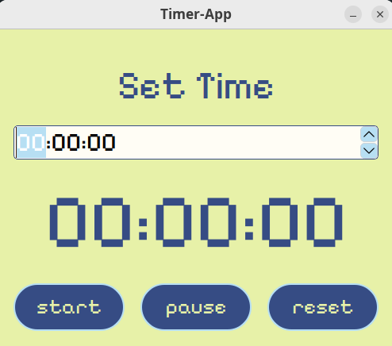

# Timer App

A simple timer application with GUI (PyQt5), sound notifications and customizable parameters.
###



## Installation:

```
 git clone https://github.com/vankaspr/TimerApp.git
 cd TimerApp
 poetry install 
 poetry run python src/main.py
```

## Opportunities:
- **Start/pause/reset** timer.
- **Audio notifications** (e.g. end-timer.wav).
- Setting the time **via the interface**.

## Project structure:

```
TimerApp/
├── libs/
    ├── logger/
        ├── config.py           # Logging settings
├── logs/                       # Log files (automatically created)
    ├── app.log
├── src/
    ├── fonts/                  # Pixelify Sans Family
    ├── media/                  # Sounds, icons, ...
    ├── styles/                 # CSS styles
    ├── ui/                     # GUI (PyQt5)
        ├── window.py           # main window
    ├── utilities/              # Auxiliary modules
        ├── timer.py            
        ├── ...
    ├── main.py                 # Source code    
...     
└── pyproject.toml              # Конфигурация Poetry
```


## CREDITS:

**🔠 font/**
- https://fonts.google.com/specimen/Pixelify+Sans

**📸 pictures/**
- https://ru.pinterest.com/pin/4644405860068318/
- https://ru.pinterest.com/pin/10555380371535871/
- https://ru.pinterest.com/pin/39828777962365566/
- https://ru.pinterest.com/pin/23925441767415374/
- https://ru.pinterest.com/pin/1548181182318421/
- https://ru.pinterest.com/pin/211247038764949393/
- https://ru.pinterest.com/pin/20477373299964905/

**🫟 icons/**
- https://www.flaticon.com/ru/free-icons

**🔊 sounds/**
- https://zvukogram.com/category/zvuki-najatiya-knopki/
- https://zvukogram.com/category/arkadnyie-zvuki/